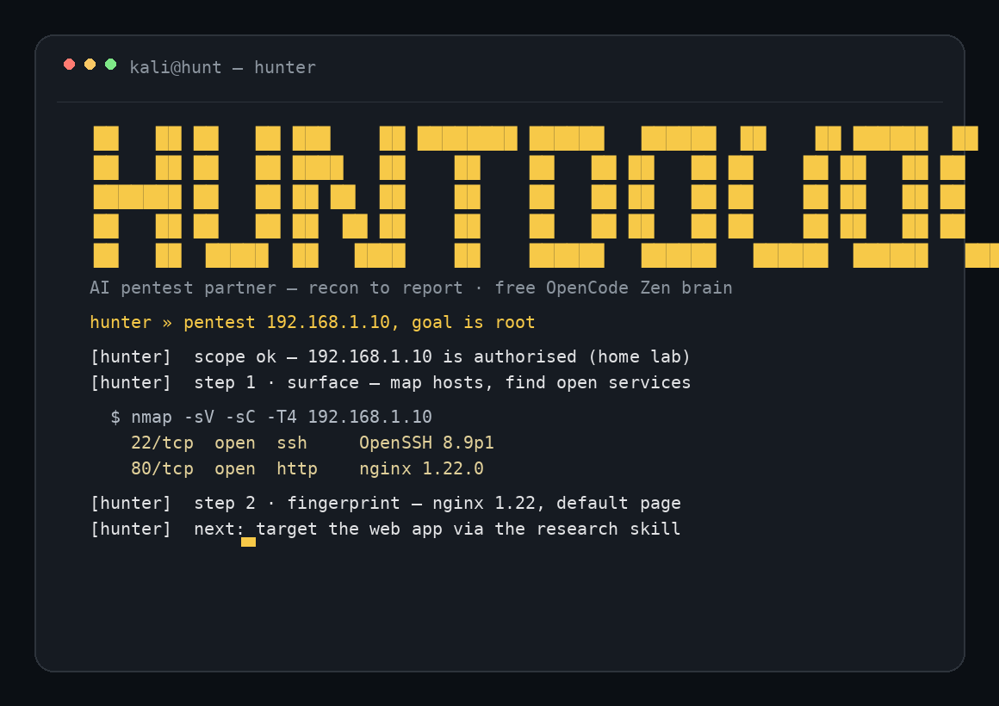

<div align="center">

# HUNTBUDDY

## An agentic penetration-testing partner for your terminal

Recon to verified findings to a consultant-grade report — with one command:
`hunter`. Mentor-style, enumeration-first, and built on free AI models with
zero API keys.

</div>

---

## The whole setup is one command

```
git clone https://github.com/malik-azad/huntbuddy.git ~/huntbuddy && bash ~/huntbuddy/bootstrap.sh
```

That single line does everything — internally:

1. **Clones** Huntbuddy into `~/huntbuddy` (main branch).
2. **Checks for the opencode engine** — the runtime Huntbuddy runs on. If it is
   missing, it installs the official build quietly (official installer,
   `~/.opencode/bin`); if it is already present, nothing is downloaded.
3. **Links the `hunter` command** into `~/.local/bin/hunter` so it works from
   any folder.
4. **Verifies** the engine version and prints a ready-to-go message.

Nothing else is downloaded, installed or kept. The command is git-based because
this repository is private — it uses *your* GitHub login, so the clone already
works on any machine where you have access.

> Manual equivalent (three steps, if you prefer to see each one):
>
> ```bash
> git clone https://github.com/malik-azad/huntbuddy.git ~/huntbuddy
> curl -fsSL https://opencode.ai/install | bash      # only if `opencode` missing
> ln -s ~/huntbuddy/tools/hunter-wrapper.sh ~/.local/bin/hunter
> ```

---

## What it looks like

This is the opening screen you get when you run `hunter`:



## Requirements

- **Anything Linux or macOS** (a terminal; curl and git).
- **No API keys, no accounts, no cloud sign-up.** The default brain is a free
  OpenCode Zen model. Optional Google/OpenRouter keys add backup brains, but
  are never required.
- Storage: the engine installs to `~/.opencode` (~240 MB, one-time, global);
  Huntbuddy itself is a few MB.

---

## What is Huntbuddy?

Huntbuddy is a self-hosted AI security agent that lives in your terminal and
works the way an experienced penetration tester works. Instead of pasting
commands around or juggling tools, you describe a target and a goal, and
Huntbuddy takes it from there:

> **map the surface → enumerate services → assess vulnerabilities → exploit →
> escalate → verify → report**

Two behaviors make it a *partner* rather than a script-runner:

- **Mentor mode.** Before every tool runs, Huntbuddy says what it is doing and
  why (tool, target, goal). After the output, it interprets the result in one
  or two plain sentences and ends with a concrete **next** step. You learn the
  method as you go.
- **Verify before trust.** Nothing is ever "found" on a guess. A false-positive
  officer re-tests every suspected finding — reproduce, cross-check from an
  independent angle, run a benign control — before it becomes a confirmed
  finding. Reports only ever contain evidence-backed results.

## How an engagement flows

```
1 · SCOPE       authorise targets (home lab, exam lab, client scope)
2 · RECON       map the network, discover hosts            (nmap sweeps)
3 · ENUMERATE   services, versions, shares, web apps      (per-service)
4 · ASSESS      versions → known CVEs → candidate flaws
5 · ATTACK      exploit → foothold                          (verified steps)
6 · POST & ESC  credential handling, privilege escalation, lateral move
7 · PROOF       re-verify every finding                    (keep evidence)
   REPORT       consultant-grade writeup in engagements/<name>/findings.md
```

## First session

```bash
hunter
```

Then just type — chat, not commands:

```
pentest 10.10.10.5, goal is root
scan 10.10.10.0/24 and enumerate all services
engagement name: acme-ctf, target acme.local, goal: domain admin
```

Huntbuddy answers in plain language, shows its reasoning before each step, and
keeps a structured record in `engagements/<name>/` as you go.

## Command reference

| Command | What it does |
| --- | --- |
| `hunter` | Start the interactive chat (TUI), from any folder |
| `hunter --help` / `-h` / `help` | Show the help screen |
| `hunter --version` / `-v` | Engine version |
| `hunter status` | Relay slot, running engine processes, skill count, health |
| `hunter whoami` | The identity card — who Hunter is |
| `hunter "message"` | Run a one-off message |
| `hunter run "message"` | Explicit one-off; bails out loudly after 240 s instead of hanging |
| `hunter auth` | Manage providers / login (Google, OpenRouter, …) |
| `hunter models [provider]` | List available models |
| `hunter skills` | List loaded skill packs |
| `hunter debug config` | Show the resolved configuration |
| `hunter session / stats / export / import / mcp / upgrade` | Engine utilities |

In-chat commands: `/guide` (mentor mode), `/verify` (sweep suspect findings),
`/learn <topic>` (teaching drill), `/report` (write the report).

## Agents

`hunter` is the lead agent (default) and orchestrates a small team:

| Agent | Role |
| --- | --- |
| **hunter** | Lead: plans, explains (mentor mode), executes, keeps goals on track |
| **scanner** | Recon/enumeration specialist — nmap, netexec, nuclei, dig, ffuf; returns compact tables |
| **critic** | False-positive officer — re-tests every suspected finding adversarially |
| **reporter** | Consultant-style report writer → `engagements/<name>/findings.md` |

## Skills & playbooks (31 packs)

Skills are plain-markdown folders; each loads on demand, so context is only
spent when relevant. Adding one is a folder with a `SKILL.md` — no code.

**Authored packs (9)**
`oscp-methodology` · `cpent-enterprise` · `research` · `privesc-linux` ·
`privesc-windows` · `bugbounty-webapi` · `verify-proof` · `consult-reporting` ·
`mentor-guidance`

**Service playbooks** — `smb` · `ssh` · `ftp` · `web-server` · `database` ·
`docker-k8s` · `pivoting` · `mobile-android` · `cicd` · more

**Web playbooks** — `sqli` · `ssrf` · `ssti` · `xxe` · `lfi-traversal` ·
`upload-rce` · `deserialization` · `webapp` router

**Phase / playbooks** — `post-exploit` · `reporting` · `ad` (attack trees) ·
`cloud` (IAM paths & metadata)

## Models

The default brain is free and refusal-free for authorized security work.
Rotation table and reality checks are in `config/free-models.md`.

| Model | Use | Refusals |
| --- | --- | --- |
| `opencode/nemotron-3-ultra-free` | main brain (default) | none |
| `opencode/nemotron-3.5-lightning-free` | fast offload (`small_model`) | none (family) |
| `google/gemini-3.5-flash` | speed dial (`/models`) | none (20 req/min cap) |

Switch any time with `/models`. Full notes, alternates and known quirks →
`config/free-models.md`.

## Configuration

Everything lives in one file, `opencode.jsonc`: brain model, agents,
permissions, skill paths. Per-session brand and rules load from `HUNTBUDDY.md`.

| Variable | Default | Purpose |
| --- | --- | --- |
| `HUNTBUDDY_HOME` | `~/huntbuddy` | folder location |
| `HUNTBUDDY_BIN` | `~/.local/bin` | where the `hunter` installs |
| `HUNTBUDDY_OPENCODE` | `opencode` on PATH | engine binary path |
| `HUNTBUDDY_RUN_TIMEOUT` | `240` | `hunter run` bail-out, seconds |

## Safety

- **Authorized scope only.** Hunter confirms a target is in scope before
  touching it; recon and enumeration on in-scope targets flow without friction.
- **Hard stops in the engine config:** `rm -rf /`, `mkfs.*`, raw writes to
  block devices are denied.
- **Scope guard helper** (`tools/helpers/hb-scope.sh`) keeps tool calls inside
  the engagement's target list.
- **Sensitive data stays local:** credentials and engagement notes live under
  `engagements/`, which is git-ignored and never leaves the machine.

## Keeping it updated — and going back

```bash
cd ~/huntbuddy
git pull                 # get the latest version from GitHub
git log --oneline        # see the history of changes
git revert <sha>         # undo a specific change (safest)
```

Because the folder is a git repository, whenever a change isn't to your liking
you can return to any earlier version. `bootstrap.sh` also runs the `git pull`
for you on re-run.

## Troubleshooting

| Symptom | Cause & fix |
| --- | --- |
| `hunter` opens to a blank screen, replies stay silent | The free relay serves **one conversation per machine at a time**. Run `hunter status`; close the other session holding the slot, then rerun `hunter`. |
| A model hiccups / errors | Free relays are shared. `/models` → pick the next in `config/free-models.md`. |
| `opencode: command not found` | Engine not on PATH — `reopen your terminal`, or run the fix line bootstrap prints. |
| Want it portable (no install on the target laptop) | Build the one-file installer: `bash dist/make-dist.sh` → run `dist/huntbuddy-install.sh`. |

## FAQ

**Does Huntbuddy work for others who clone the repo?**
Yes. The folder is the entire product: skills, playbooks, config, commands,
documents. Whoever clones it (and has the engine, which `bootstrap.sh` adds)
gets the same tool. AI responses use *their own* relay login — no shared
credentials are stored anywhere.

**Do I need AI keys?**
No. The default model is free. Keys are optional backups.

**Where does my data go?**
Engagement notes stay in `engagements/` on the machine. Nothing is sent to any
third party. Free-tier models may converse on prompts (no client secrets,
ever).

## Project layout

```
huntbuddy/
  bootstrap.sh      one-command setup (clone + engine + hunter)
  opencode.jsonc    brain, agents, permissions, skills config
  HUNTBUDDY.md      brand & operator rules for every session
  skills/           9 authored methodology packs
  playbooks/        22 service/web/phase playbooks
  tools/            hunter wrapper + helpers (scope guard, reports, scaffold)
  config/           model rotation notes
  docs/             PDF manual, diagrams, screenshot generator
  dist/             make-dist.sh builds the portable installer
  engagements/      one folder per engagement (git-ignored)
```

## Documentation

- `docs/Huntbuddy-Guide.pdf` — the full illustrated manual
  (rebuild it with `python3 docs/build_manual.py`).
- `docs/QUICKSTART.md` · `docs/FIRST-RUN.md` — getting around fast.
- `config/free-models.md` — model table, rotation, reality checks.

## License

[MIT](LICENSE) — third-party attributions in the [NOTICE](NOTICE) file.

---

<div align="center">

**HUNTER — the one-word command for authorized security testing.**

</div>